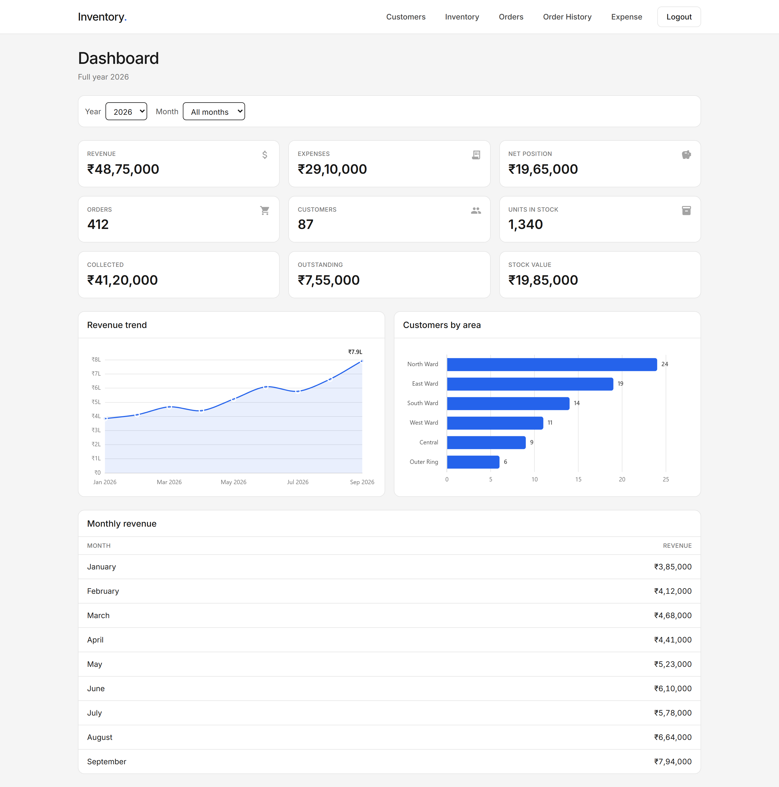
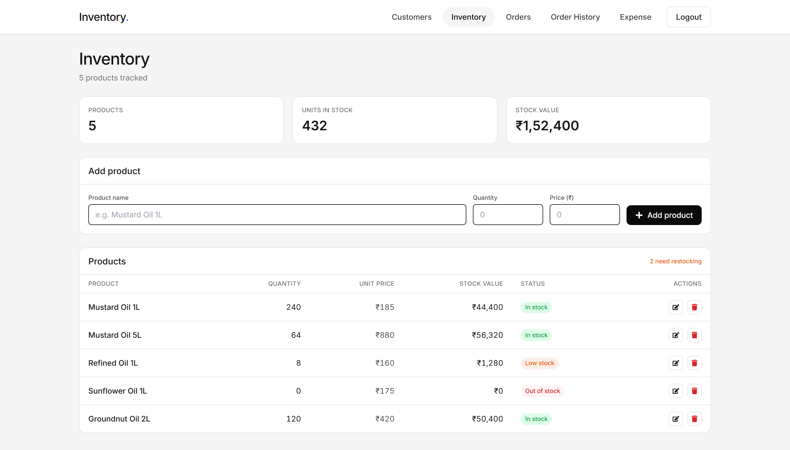
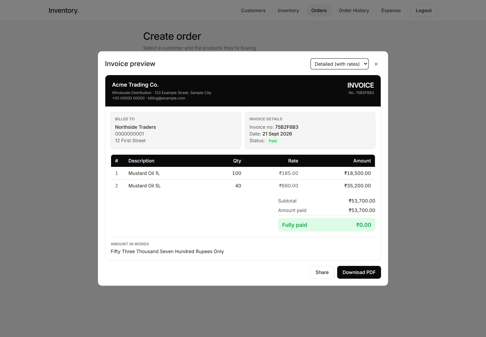
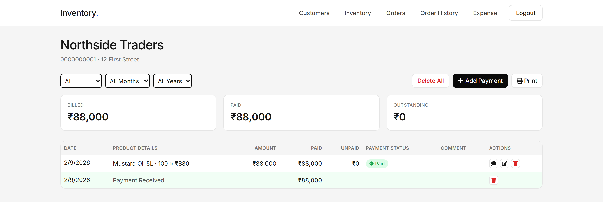
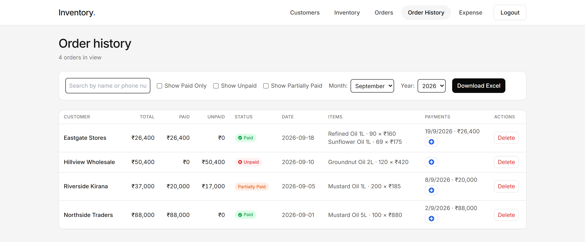
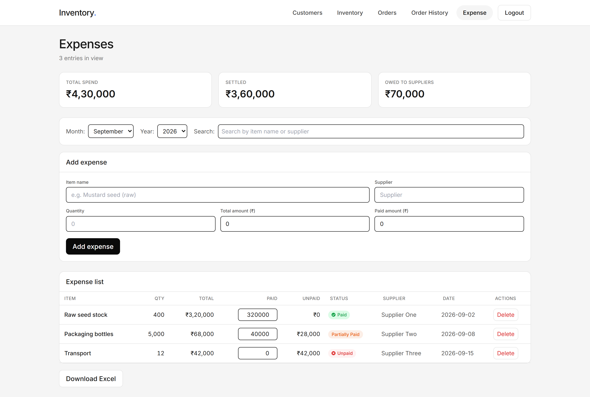
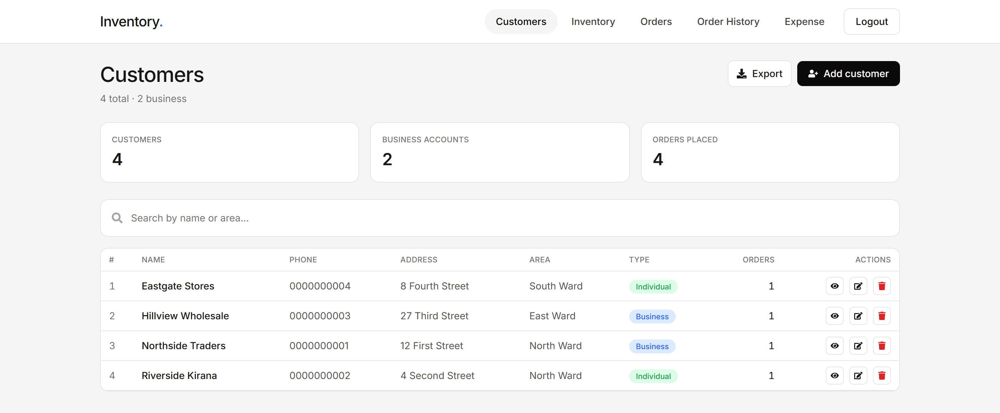
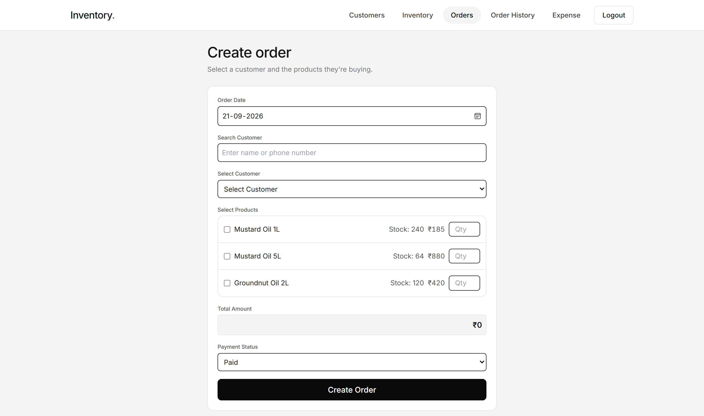

<div align="center">

# Inventory Tracking Dashboard

**A back-office for a small wholesale business — stock, customers, orders, payments and expenses in one place.**

Built with React 18, Vite and Firebase. Every order turns into a real, selectable PDF invoice;
every customer has a running ledger of what they owe.

[](https://react.dev)
[](https://vitejs.dev)
[](https://tailwindcss.com)
[](https://firebase.google.com)
[](#license)



</div>

---

## What it does

This is not a generic admin template. It is shaped around one real workflow: a wholesaler
sells goods on credit, collects payment in instalments, and needs to know at any moment who
owes what.

- **Orders are billed, not just recorded.** Creating an order opens an invoice preview and
  produces a PDF built natively with jsPDF — vector text you can select and search, not a
  screenshot of a web page.
- **Payments are partial by default.** An order can be paid, unpaid, or partially paid, and
  each instalment is stored as its own dated payment record.
- **Every customer has a ledger.** Orders and payments interleave on one timeline, with a
  running outstanding balance and a printable account statement.
- **Money flows both ways.** Expenses track what you owe suppliers, so the dashboard can show
  a true net position rather than just revenue.

## Screenshots

### Dashboard

Nine KPI tiles scoped by a single year/month filter, a revenue trend line, customer
distribution by area, and a plain-table twin of the chart for anyone reading with a screen
reader.


### Inventory

Products with quantity, unit price and derived stock value. Items below ten units are flagged
**Low stock**; zero-quantity items are flagged **Out of stock**, and the card header counts
how many need restocking.



### Create order & invoice

Pick a customer, tick products, enter quantities. Stock on hand is shown inline and orders
that exceed it are rejected. On submit you get an invoice preview — detailed with rates, or
compact — that downloads or shares as a PDF.



### Customer ledger



### Order history & expenses

<table>
<tr>
<td width="50%"></td>
<td width="50%"></td>
</tr>
</table>

<details>
<summary>More screens</summary>

<br>

**Customers** — searchable directory with per-customer order counts and Excel export.



**Create order form**



</details>

## Features

**Orders & invoicing**
- Multi-product orders with live stock validation and running total
- Paid / unpaid / partially paid statuses, with dated instalment records
- Native PDF invoices in two layouts (detailed with rates, or compact)
- Rupee amounts spelled out in words using Indian numbering (lakh / crore)
- Web Share API support, falling back to download where sharing is unavailable

**Customers**
- Directory with search by name or area, and business vs. individual typing
- Per-customer ledger interleaving orders, payments and comments
- Printable account statement PDF for any date range
- Excel export via SheetJS

**Inventory**
- Add, edit and delete products with quantity and unit price
- Automatic low-stock and out-of-stock flags, plus total stock valuation

**Expenses**
- Supplier spend with paid / unpaid split and outstanding balances
- Month and year filters, search by item or supplier, Excel export

**Dashboard**
- Revenue, expenses, net position, orders, customers and units in stock
- Collected vs. outstanding receivables and total stock value
- Revenue trend and customer-by-area charts, scoped by one year/month filter
- Accessible table twin of the revenue chart

**Platform**
- Firebase Authentication with protected routes
- Firestore as the datastore
- Indian currency and date formatting throughout (`en-IN`, `₹`, `dd MMM yyyy`)
- Responsive layout with a mobile navigation drawer

## Tech stack

| Layer | Choice |
|---|---|
| Framework | React 18 |
| Build | Vite 5 |
| Styling | Tailwind CSS 3 |
| Routing | React Router 6 |
| Data & auth | Firebase (Firestore + Authentication) |
| Charts | Chart.js 4 via react-chartjs-2 |
| PDF | jsPDF + jspdf-autotable |
| Spreadsheets | SheetJS (xlsx) |
| Notifications | react-toastify |
| Icons | react-icons |

## Getting started

### Prerequisites

- Node.js 18 or newer
- A Firebase project with Firestore and Email/Password authentication enabled

### Install

```bash
git clone https://github.com/Shaikh224/Inventory-Tracking-Dashboard.git
cd Inventory-Tracking-Dashboard
npm install
```

### Configure

Create a `.env` file in the project root:

```ini
VITE_FIREBASE_API_KEY=your-api-key
VITE_FIREBASE_AUTH_DOMAIN=your-project.firebaseapp.com
VITE_FIREBASE_PROJECT_ID=your-project-id
VITE_FIREBASE_STORAGE_BUCKET=your-project.appspot.com
VITE_FIREBASE_MESSAGING_SENDER_ID=000000000000
VITE_FIREBASE_APP_ID=1:000000000000:web:abcdef
```

Invoices and statements print a letterhead. It is read from the environment so the repo
carries no business details of its own — set these to your own, or leave them out for
neutral placeholders. Blank optional fields are dropped rather than printed as empty
separators:

```ini
VITE_COMPANY_NAME=Your Company Name
VITE_COMPANY_TAGLINE=Optional strapline
VITE_COMPANY_ADDRESS=Street, City, State
VITE_COMPANY_PHONE=+00 00000 00000
VITE_COMPANY_EMAIL=billing@example.com
```

Firestore uses four collections — `inventory`, `customers`, `orders` and `expenses` — each
created on first write, so there is no schema to set up in advance.

### Run

```bash
npm run dev      # dev server on http://localhost:5173
npm run build    # production build to dist/
npm run preview  # serve the production build
npm run lint     # ESLint
```

### Running without Firebase

Two dev-only flags open the whole UI with sample data and no backend — this is how the
screenshots above were taken:

```ini
VITE_SKIP_AUTH=true     # bypass the login screen
VITE_DEMO_DATA=true     # serve the fixtures in src/lib/demoData.js
```

Both default to off and are ignored unless explicitly set to `true`.

## Project structure

```
src/
├── components/
│   ├── Dashboard.jsx         KPIs, charts, monthly revenue table
│   ├── Inventory.jsx         Product CRUD and stock flags
│   ├── Orders.jsx            Order creation + invoice preview modal
│   ├── OrderHistory.jsx      Past orders, filters, payment entry
│   ├── Customers.jsx         Customer directory
│   ├── CustomerDetails.jsx   Per-customer ledger and statement
│   ├── Expenses.jsx          Supplier spend
│   ├── Header.jsx            Navigation
│   ├── Login.jsx             Email/password sign-in
│   └── ui.jsx                Shared primitives (Card, StatTile, EmptyState…)
├── lib/
│   ├── pdf.js                Invoice and statement generation
│   ├── chartTheme.js         Chart.js options and custom plugins
│   ├── format.js             Currency, number and date formatting
│   └── demoData.js           Dev-only fixtures
├── AuthContext.jsx           Auth state and the dev bypass
├── PrivateRoute.jsx          Route guard
├── firebase.js               Firebase initialisation
└── App.jsx                   Routes
```

## Notes

- `.env` is gitignored. Firebase web config values are not secrets, but Firestore security
  rules are what actually protect your data — set them before deploying.
- `public/_redirects` is included for SPA routing on Netlify.

## License

Released under the MIT License.

## Author

**Shaikh224** — [GitHub](https://github.com/Shaikh224)
